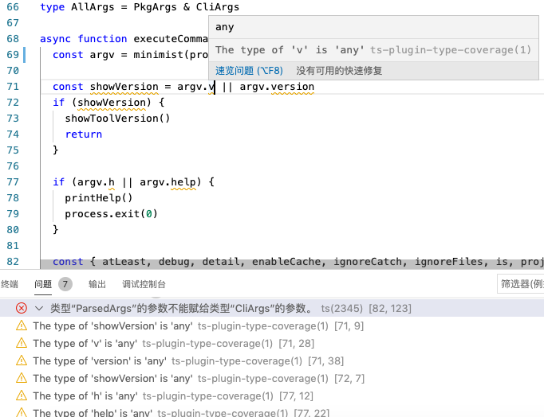

# type-coverage

简体中文 | [English](./README.md)

一个用于检查typescript代码的类型覆盖率的CLI工具。

该工具将检查所有标识符的类型，`类型覆盖率 = any类型的所有标识符` / `所有的标识符`，值越高，则越优秀。

[](https://david-dm.org/plantain-00/type-coverage)
[](https://david-dm.org/plantain-00/type-coverage#info=devDependencies)
[](https://ci.appveyor.com/project/plantain-00/type-coverage/branch/master)

[](https://badge.fury.io/js/type-coverage)
[](https://www.npmjs.com/package/type-coverage)
[](https://github.com/plantain-00/type-coverage)
[](https://codechecks.io)

## 用例

+ 显示从现有的JS代码渐进迁移到TS代码的进度。
+ 通过运行CI避免引入意外的`any`
+ 显示从现有的宽松TS代码渐进转变为严格TS代码的进度。[migrate to stricter typescript](#migrate-to-stricter-typescript)

## 安装

`yarn global add type-coverage`

## 使用

run `type-coverage`

## 参数

name | type | description
--- | --- | ---
`-p`, `--project` | string? | 告诉 CLI `tsconfig.json` 文件的位置(Added in `v1.0`)
`--detail` | boolean? | 显示详情(Added in `v1.0`)
`--at-least` | number? | 设置闸值，如果覆盖率小于该值，则失败(Added in `v1.0`)
`--debug` | boolean? | 显示调试信息(Added in `v1.0`)
`--suppressError` | boolean? | process exit 0 even failed or errored
`--suppressError` | boolean? | process exit 0 even failed or errored
`--strict` | boolean? | 是否开启严格模式(Added in `v1.7`)
`--ignore-catch` | boolean? | [忽略捕获](#ignore-catch)(Added in `v1.13`)
`--cache` | boolean? | [启用缓存](#enable-cache)(Added in `v1.10`)
`--ignore-files` | [忽略文件](#ignore-files)(Added in `v1.14`)
`-h`, `--help` | boolean? | 显示帮助信息(Added in `v2.5`)
`--is` | number? | 设置闸值，如果覆盖率不等于该值，则失败(Added in `v2.6`)
`--update` | boolean? | 如果 package.json 中存在typeCoverage选项，则根据 "atLeast" or "is" 值更新 (Added in `v2.6`)
`--update-if-higher` | boolean? | 如果新的类型覆盖率更高，则将package.json 中的"typeCoverage"更新到当前这个结果(Added in `v2.20`)
`--ignore-unread` | boolean? | 允许写入任何隐式类型的变量(Added in `v2.14`)
`--ignore-nested` | boolean? | 忽略any类型的参数 eg: `Promise<any>`(Added in `v2.16`)
`--ignore-as-assertion` | boolean? | 忽略 as 断言, eg: `foo as string`(Added in `v2.16`)
`--ignore-type-assertion` | boolean? | 忽略类型断言eg: `<string>foo`(Added in `v2.16`)
`--ignore-non-null-assertion` | boolean? | 忽略非空断言, eg: `foo!`(Added in `v2.16`)
`--ignore-object` | boolean? | `Object` 类型不算 any,  eg: `foo: Object`(Added in `v2.21`)
`--ignore-empty-type` | boolean? | 忽略空类型, eg: `foo: {}`(Added in `v2.21`)
`--show-relative-path` | boolean? | 在详细信息中显示相对路径(Added in `v2.17`)
`--history-file` | string? | 保存历史记录的文件名(Added in `v2.18`)
`--no-detail-when-failed` | boolean? | 当CLI失败时不显示详细信息(Added in `v2.19`)(使用 `--no-detail-when-failed=true` 启用 <https://github.com/plantain-00/type-coverage/issues/113>)
`--report-semantic-error` | boolean? | 报告 typescript 语义错误(Added in `v2.22`)
`-- file1.ts file2.ts ...` | string[]? | 仅检查这些文件, 适用于 `lint-staged`(Added in `v2.23`)
`--cache-directory` | string? | [设置缓存目录]((#enable-cache))(Added in `v2.24`)

### 严格模式

如果标识符的存在且至少包含一个`any`, 比如`any[]`, `ReadonlyArray<any>`, `Promise<any>`, `Foo<number, any>`,那么他将被视为`any`。

类型断言，类似 `foo as string`, `foo!`, `<string>foo` 将会被识别为未覆盖，排除`foo as const`, `<const>foo`, `foo as unknown`和由`isTypeAssignableTo`支持的其它安全类型断言

Object类型(like `foo: Object`) 和 空类型 (like `foo: {}`) 将被视为any。

当然，未来的小版本可能会在这种模式下引入更严格的类型检查，这可能会降低类型覆盖率。

### 启用缓存

保存和复用未变更的文件以及独立于`.type-coverage`的已更改文件（或者通过`--cache-directory`设置）的类型检查结果，以提高速度。

### 忽略捕获

我们想要追求100%的类型覆盖率最大的阻碍是`try {} catch {}` 。

你可以根据 [Allow type annotation on catch clause variable](https://github.com/Microsoft/TypeScript/issues/20024)来修复。

但在这之前你应该设置 `--ignore-catch --at-least 100`.

你的异常捕获代码块应该看起来像这样

```ts
try {
  await ...
} catch (anyErr) {
  const err = <Error> anyErr
}
```

以获得更高的类型覆盖率。

### ignore files
### 忽略某些文件

在计算的时候忽略某些文件, 例如: `--ignore-files "demo1/*.ts" --ignore-files "demo2/foo.ts"`

## package.json 中的配置

```json5
  "typeCoverage": {
    "atLeast": 99, // same as --at-least (Added in `v1.4`)
    "is": 99, // same as --is (Added in `v2.6`)
    "cache": true, // same as --cache (Added in `v2.11`)
    "debug": true, // same as --debug (Added in `v2.11`)
    "detail": true, // same as --detail (Added in `v2.11`)
    "ignoreCatch": true, // same as --ignore-catch (Added in `v2.11`)
    "ignoreFiles": ["demo1/*.ts", "demo2/foo.ts"], // same as --ignore-files "demo1/*.ts" --ignore-files "demo2/foo.ts" (Added in `v2.11`)
    "project": "tsconfig.json", // same as --project tsconfig.json or -p tsconfig.json (Added in `v2.11`)
    "strict": true, // same as --strict (Added in `v2.11`)
    "suppressError": true, // same as --suppressError (Added in `v2.11`)
    "update": true, // same as --update (Added in `v2.11`)
    "updateIfHigher": true, // same as --update-if-higher (Added in `v2.20`)
    "ignoreUnread": true, // same as --ignore-unread (Added in `v2.14`)
    "ignoreNested": true, // same as --ignore-nested (Added in `v2.16`)
    "ignoreAsAssertion": true, // same as --ignore-as-assertion (Added in `v2.16`)
    "ignoreTypeAssertion": true, // same as --ignore-type-assertion (Added in `v2.16`)
    "ignoreNonNullAssertion": true, // same as --ignore-non-null-assertion (Added in `v2.16`)
    "ignoreObject": true, // same as --ignore-object(Added in `v2.21`)
    "ignoreEmptyType": true, // same as --ignore-empty-type(Added in `v2.21`)
    "showRelativePath": true, // same as --show-relative-path (Added in `v2.17`)
    "historyFile": "typecoverage.json", // same as --history-file (Added in `v2.18`)
    "noDetailWhenFailed": true, // same as --no-detail-when-failed (Added in `v2.19`)
    "reportSemanticError": true, // same as --report-semantic-error (Added in `v2.22`)
    "cacheDirectory": "custom-directory", // same as --cache-directory (Added in `v2.24`)
  },
```

## 忽略行

在注释（`//` 或者 `/*  */`）中使用`type-coverage:ignore-next-line` or `type-coverage:ignore-line` 以忽略行

```ts
try {
  // type-coverage:ignore-next-line
} catch (error) { // type-coverage:ignore-line

}
```

## 迁移到更严格的 Typescript

基于更严格的配置来创建一个新的tsconfig配置文件(例如: `tconfig.type-coverage.json`)，该文件扩展自`tsc`'s `tsconfig.json`。

```json
{
  "extends": "./tsconfig.json",
  "compilerOptions": {
    "strict": true
  }
}
```

运行 `type-coverage -p ./tconfig.type-coverage.json --report-semantic-error`, 来审查语义错误报告。

当所有的语义错误问题都解决之后，再合并两个`tsconfig`文件。

## 添加类型覆盖率的动态徽章

使用你自己项目的url:

```md
[](https://github.com/plantain-00/type-coverage)
```

## 与PR集成

使用 [codechecks](https://codechecks.io) 你可以将 `type-coverage` 与 GitHub's 的 Pull Requests 集成. 参考 [type-coverage-watcher](https://github.com/codechecks/type-coverage-watcher).

[](https://github.com/codechecks/type-coverage-watcher)

## typescript 覆盖率报告

使用 [typescript-coverage-report](https://github.com/alexcanessa/typescript-coverage-report) 你可以生成 typescript 覆盖率报告.

[](https://github.com/alexcanessa/typescript-coverage-report)

## API(Added in `v1.3`)

```ts
import { lint } from 'type-coverage-core'

const result = await lint('.', { strict: true })
```

```ts
export function lint(project: string, options?: Partial<LintOptions>): Promise<FileTypeCheckResult & { program: ts.Program }>
export function lintSync(compilerOptions: ts.CompilerOptions, rootNames: string[], options?: Partial<LintOptions>): FileTypeCheckResult & { program: ts.Program } // Added in `v2.12`

export interface LintOptions {
  debug: boolean,
  files?: string[],
  oldProgram?: ts.Program,
  strict: boolean, // Added in v1.7
  enableCache: boolean, // Added in v1.10
  ignoreCatch: boolean, // Added in v1.13
  ignoreFiles?: string | string[], // Added in v1.14
  fileCounts: boolean, // Added in v2.3
  absolutePath?: boolean, // Added in v2.4
  processAny?: ProccessAny, // Added in v2.7
  ignoreUnreadAnys: boolean, // Added in v2.14
  ignoreNested: boolean // Added in v2.16
  ignoreAsAssertion: boolean // Added in v2.16
  ignoreTypeAssertion: boolean // Added in v2.16
  ignoreNonNullAssertion: boolean // Added in v2.16
  ignoreObject: boolean // Added in v2.21
  ignoreEmptyType: boolean // Added in v2.21
  reportSemanticError: boolean // Added in v2.22
  cacheDirectory: string // Added in v2.24
}

export interface FileTypeCheckResult {
  correctCount: number
  totalCount: number
  anys: FileAnyInfo[]
  fileCounts: { // Added in v2.3
    correctCount: number,
    totalCount: number,
  }[]
}

export interface FileAnyInfo {
  line: number
  character: number
  text: string
  kind: FileAnyInfoKind //  Added in v2.13
}

export const enum FileAnyInfoKind {
  any = 1, // any
  containsAny = 2, // Promise<any>
  unsafeAs = 3, // foo as string
  unsafeTypeAssertion = 4, // <string>foo
  unsafeNonNull = 5, // foo!
}

export type ProccessAny = (node: ts.Node, context: FileContext) => boolean
```

## type-coverage 的 typescript 语言服务插件(Added in `v2.12`)


`yarn add ts-plugin-type-coverage -D`

```json5
{
  "compilerOptions": {
    "plugins": [
      {
        "name": "ts-plugin-type-coverage",
        "strict": true, // for all configurations, see LintOptions above
        "ignoreCatch": true,
      }
    ]
  }
}
```

对于VSCode用户，请选择“使用工作区版本”，请参见<https://github.com/microsoft/TypeScript/wiki/Writing-a-Language-Service-Plugin#testing-locally>，或者仅使用下面的插件。

## VSCode 插件

<https://marketplace.visualstudio.com/items?itemName=york-yao.vscode-type-coverage>

通过 `Preferences` - `Settings` - `Extensions` - `Type Coverage` 配置

如果 VSCode 插件的结果与 CLI 的结果不同，可能是因为你项目根目录的 `tsconfig.json` 与 CLI `tsconfig.json` 配置不同。

如果插件无法正常工作，你也许可以参考下有没有对应的解决办法

+ <https://github.com/plantain-00/type-coverage/issues/86#issuecomment-907814000>

## 常见问题

> Q: 这包括JavaScript文件吗？

是的，这个包调用Typescript API，Typescript 能解析为Javascript文件，所以这个包也可以。

## 更新日志

[CHANGELOG for minor and patch release](./CHANGELOG.md)

### v2

1. Move `typescript` from `dependencies` to `peerDependencies`
2. Move API from package `type-coverage` to package `type-coverage-core`

```ts
// v1
import { lint } from 'type-coverage'
lint('.', false, false, undefined, undefined, true)

// v2
import { lint } from 'type-coverage-core'
lint('.', { strict: true })
```
